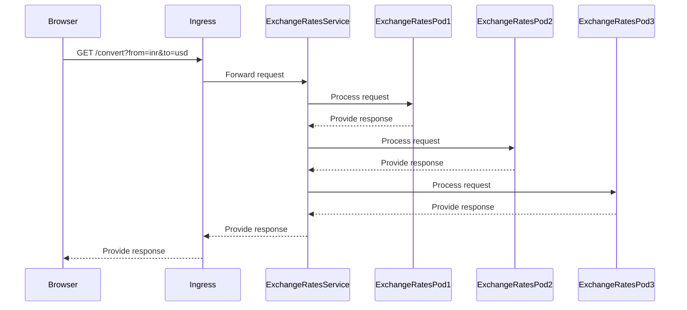

## Kubernetes manifests
- The k8s folder consist of the config files required to deploy the service to k8s cluster
- For local testing Kind cluster was used. Updated the given kind script to install ingress-nginx controller to the cluster.
- so the kind script will install ingress-nginx controller used to expose the service.
- extraPortMapping for ingress is added in the script
- After deploying this update your /etc/hosts to map 127.0.0.1 to my-rates.com
